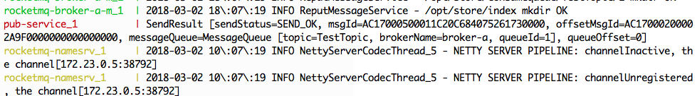
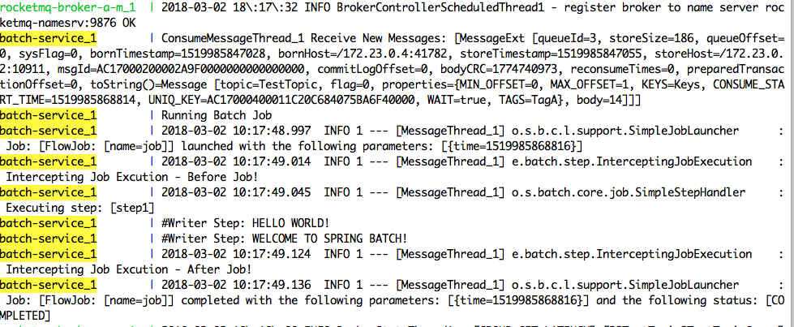

# Running Spring Batch Job via RocketMQ Sample
rocketmq version: 4.0.0-incubating

+ rocketmq-namesrv: RocketMQ Name Server
+ rocketmq-broker-a-m: RocketMQ Broker
+ pub-service: Publish & Subscribe Messages
+ rocketmq-console: UI for visualization Pub & Sub
+ batch-service: Spring Batch Job (Batch Job Consumer)


The Pub Service publish a message by (http://localhost:9909/pub-message).
After that, the Batch Service receives a message and runs job

#### Publish a message


#### Receive a message and run Job


### Usage:

#### Pub Service
```
$ cd pub-service
$ mvn clean package
```

#### RocketMQ Console
```
$ cd rocketmq-console
$ mvn clean package
```

#### Batch Service
```
$ cd batch-service
$ mvn clean package
```

#### docker-compose:
```
docker-compose up
```

### Testing Pub Sub Service

#### Publish a mesage and Running Batch Service via RocketMQ
http://localhost:9909/pub-message

#### RocketMQ Console
http://localhost:8080

#### Checking Batch Job in Console

#### Run Job via API
http://localhost:9709/launchjob

####
### Reference
[RockerMQ Docker Sample - Github](https://github.com/jingxizheng/rocketmq-docker-sample)

[Spring Batch](https://examples.javacodegeeks.com/enterprise-java/spring/batch/spring-batch-job-parameters-example/)